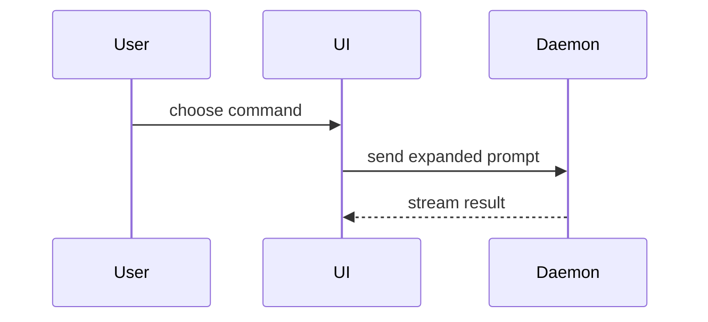

使用以下模板编写 PR 正文：

```markdown
## Summary

<diagram, diff-sketch, or tree>

## Evidence

- **Before:** <screenshot/output/failing test run>
  **After:** <screenshot/output/passing test run>

## Merge Danger

**Door:** <one-way or two-way>

<optional: description>

**Blast Radius:** <one-word description>

<optional: potential ramifications of merge>
```

## 章节

省略所有铺垫，并保持正文简短。使用用户在 `CONTEXT.md` 中定义的 domain language。

### Summary

选择能说明关键点的最小 view。

- 使用 pseudocode 展示 logic 或 algorithm：

```text
on(save)
  if content is unchanged
    return cached result
  write new content
  return fresh result
```

- 使用 call tree 展示 runtime control flow：

```text
submitForm
  createSession
    persistPrompt
    launchAgent
  navigateToSession
```

- 使用 component tree 展示 UI structure，并包含相关的 state 和 module boundaries：

```tsx
<SessionPage>(apps / example / src / routes / session.tsx);
useSessionEvents() < SessionToolbar > <RunSkillButton>(packages / ui);
```

- 使用 shallow file tree 展示 file responsibility 或 broad refactor：

```text
src/
├── commands/       # parses user actions
├── sessions/       # owns session state
└── transport/      # sends API requests
```

- 使用 Mermaid 展示 component interaction、control flow 或 data flow：



- 如果重点是改了什么，并且上下文结构已经存在，请使用 `diff`。让 diff 的形状与主题匹配。

对于 component change：

```diff
 <SessionPage>
   useSessionEvents()
   <SessionToolbar>
+    <RunSkillButton />
   <SessionTimeline>
+    <SkillResultCard />
```

对于 file-layout change：

```diff
 src/
 ├── commands/
+│   └── show-me.ts       # expands the slash command
 ├── sessions/
-└── transport.ts
+└── transport/
+    ├── client.ts
+    └── stream.ts
```

对于 call-tree 或 call-stack change：

```diff
 submitForm
   createSession
     persistPrompt
+    expandSkillMention
     launchAgent
-  navigateToSession
+  navigateToSession
+    subscribeToEvents
```

对于 state 或 control-flow change：

```diff
 on(save)
-  write content
+  if content is unchanged
+    return cached result
+  write new content
+  invalidate cache
```

- 如果大部分内容都是新增的，省略上下文会隐藏 ownership 或顺序，或者用户需要可复制的目标结构，请展示整个 block：

```ts
function expandSkill(command: string): string {
  const skillName = command.slice(1);
  return `use the ${skillName} skill`;
}
```

#### 指引

将每个 visual 放在它所支持的简短文本旁边。只保留回答用户当前问题或解决当前讨论点所需的 calls、files、props、states 和 boundaries。

你可以使用其中一种或几种形式，通常不需要全部使用。根据实际情况判断，不要向用户堆积信息。

### Evidence

提供变更可用的具体证据。展示 before 和 after。

如果环境支持并且变更可以视觉化，screenshots 是最高等级的证据。

Execution-based evidence 次之，例如 test results 和 console output。使用 pseudocode 展示之前失败、现在通过的准确 test。

### Merge Danger

说明变更属于 one-way door 还是 two-way door。Two-way door 可以撤回，one-way door 则不能。回滚成本低的 PR 风险更低。包含 destructive actions 或难以撤销决策的变更属于 one-way door。

Blast radius 是该 PR 引入变更的潜在影响或范围。考虑所有可能性，例如 layout shift、consumer breakage 和 mobile responsiveness。
